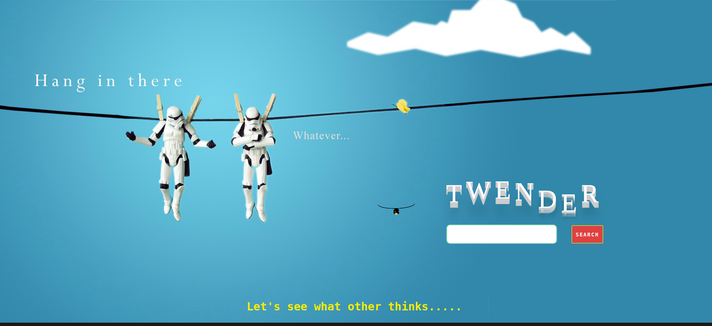

<h1> Codechella_Twender </h1>
This is a public repository for Twitter organised Codechella hackathon project submission.

<h2> Project name : Twender </h2>

<h4>Twender provides the user with an adumbration of the society's opinion in a single click.
Twender app collects large numbers feeds from twitter based on searched topic, analyzes them, and classifies them into different polarities (positive,negative,neutral). It also provides the user with detailed reports of what’s trending with the popularity meter. Other than that there is also a functionality to compare two things based on what’s trending. 
Just type in anything trending like Amazon or trump etc...</h4>

 Youtube link : https://www.youtube.com/watch?v=JVzSeHlCTf0&feature=youtu.be 

